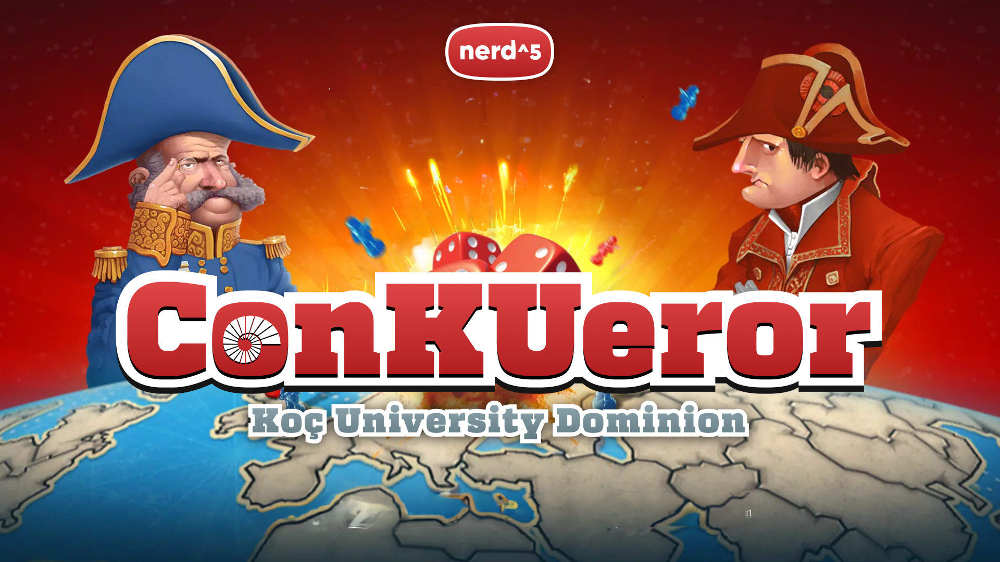
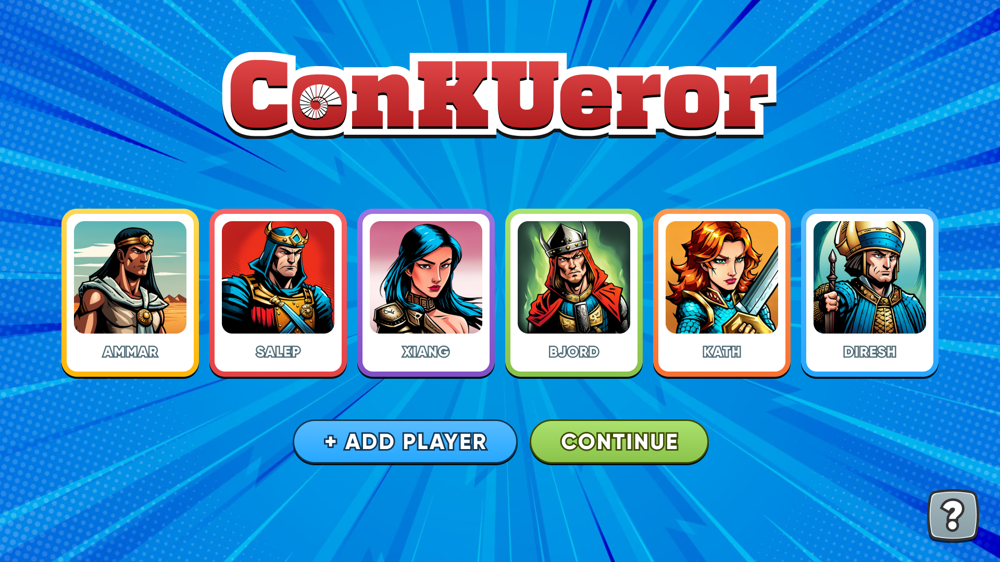
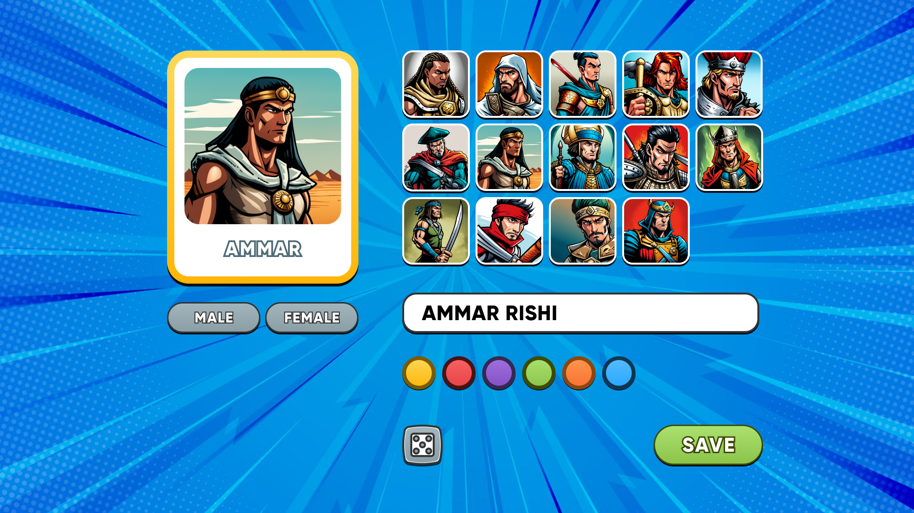
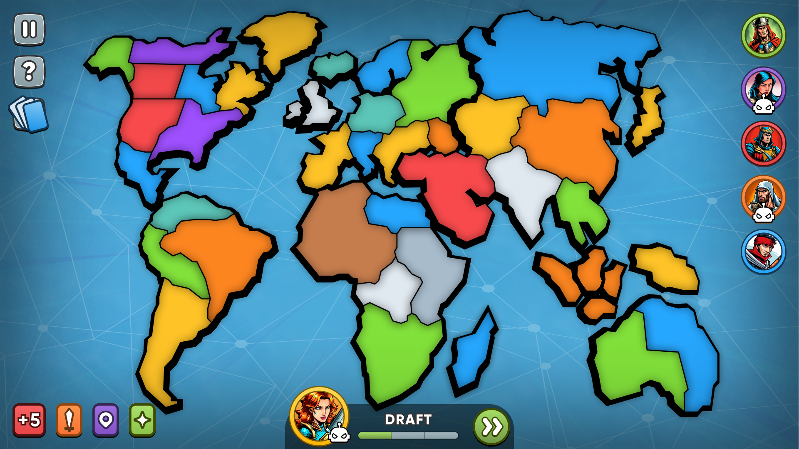
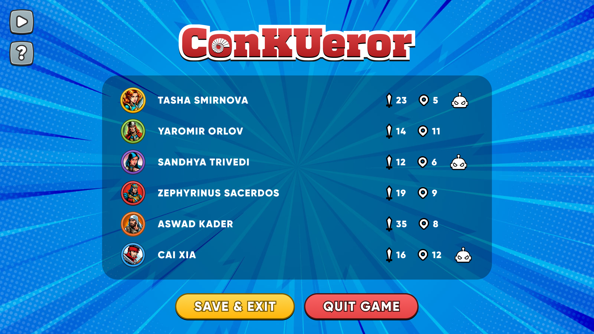

ConKUeror is a game built in Java as a term project for COMP 302: Software Engineering course at Koç University in Spring 2023.
- Custom application and routing framework inspired by React Router
- Custom reactive-like functional programming framework for UI, inspired by React and Vue
- Java design patterns implemented throughout the project
- Custom designed beautiful UI components inspired by RISK: Global Domination desktop game
- Multithreaded application engine using Java's new Virtual Threads
- Built with Java 21 and Swing

### Game Description
ConKUeror is a fun and exciting strategy game inspired by the popular game RISK. In this game, players compete to conquer the world by launching daring attacks, defending themselves on all fronts, and sweeping across vast continents with boldness and cunning.
- Play against AI or other players
- Play with up to 5 other players
- Customize your players
- Play on a full political map of the world
- Chance cards that bring randomness to the game
- Army and territory cards that can be used to gain an advantage
- Beautiful UI/UX

### Screenshots
**Add up to 6 players (including AI players)**

**Customize your players, choose colors and avatars**

**Play on a full political map of the world**

**See real-time statistics on the leaderboard**

### Team
- Altun Hasanli (ahasanli19@ku.edu.tr)
- Mert Balçık (mbalcik20@ku.edu.tr)
- Kazım Toprak Güler (kguler20@ku.edu.tr)
- Zindan Kurt (zkurt18@ku.edu.tr)
- Ömer Nadir Civelek (ocivelek19@ku.edu.tr)
