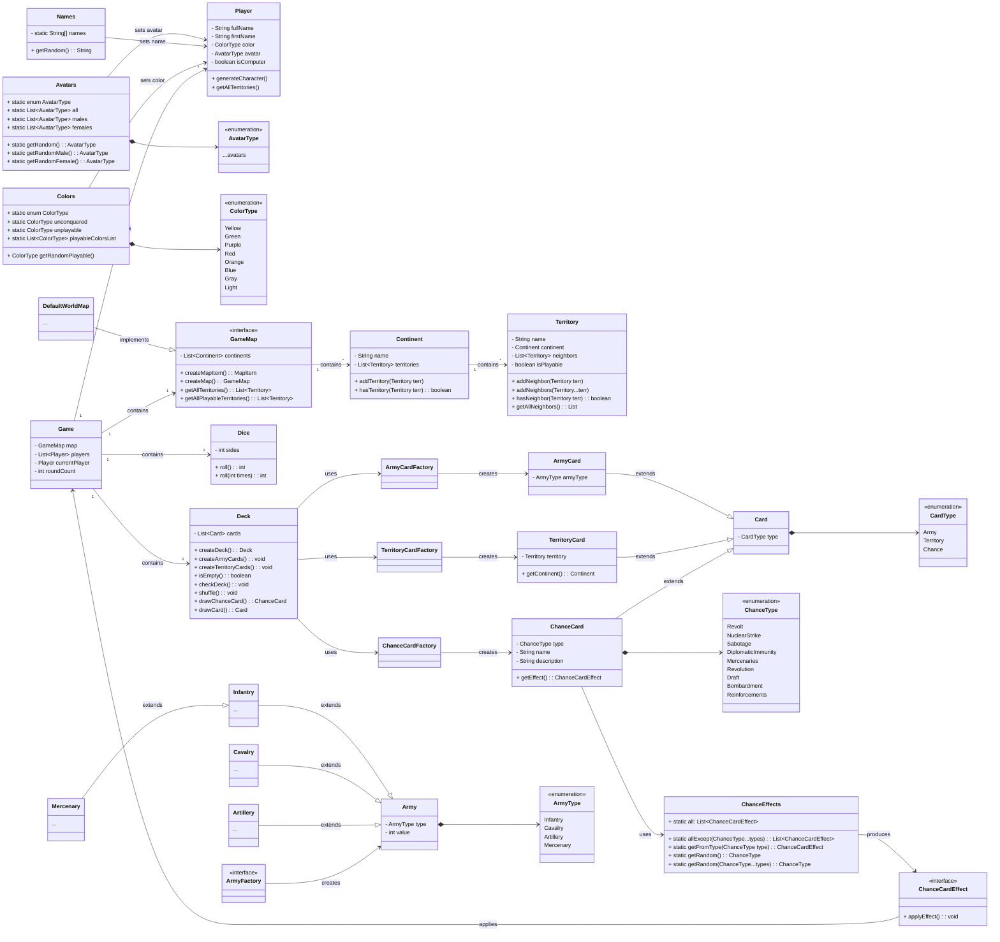

```mermaid
%%{init: {"theme": "default"}%%
classDiagram
direction LR
Avatars --> Player : sets avatar
Names --> Player: sets name
Colors --> Player : sets color
class Avatars {
	+ static enum AvatarType
	+ static List~AvatarType~ all
	+ static List~AvatarType~ males
	+ static List~AvatarType~ females
	+ static getRandom(): AvatarType
	+ static getRandomMale(): AvatarType
	+ static getRandomFemale(): AvatarType
}
Avatars *--> AvatarType
class AvatarType {
	<<enumeration>>
	...avatars
}
class Colors {
	+ static enum ColorType
	+ static ColorType unconquered
	+ static ColorType unplayable
	+ static List~ColorType~ playableColorsList
	+ ColorType getRandomPlayable()
}
Colors *--> ColorType
class ColorType {
	<<enumeration>>
	Yellow
	Green
	Purple
	Red
	Orange
	Blue
	Gray
	Light
}
class Names {
	- static String[] names
	+ getRandom(): String
}
class Player {
	- String fullName
	- String firstName
	- ColorType color
	- AvatarType avatar
	- boolean isComputer
	+ generateCharacter()
	+ getAllTerritories()
}
GameMap "1" --> "*" Continent : contains
Continent "1" --> "*" Territory : contains
class GameMap {
	<<interface>>
	- List~Continent~ continents
	+ createMapItem(): MapItem
	+ createMap(): GameMap
	+ getAllTerritories(): List~Territory~
	+ getAllPlayableTerritories(): List~Territory~
}
DefaultWorldMap --|> GameMap : implements
class DefaultWorldMap {
	...
}
class Continent {
	- String name
	- List~Territory~ territories
	+ addTerritory(Territory terr)
	+ hasTerritory(Territory terr): boolean
}
class Territory {
	- String name
	- Continent continent
	- List~Territory~ neighbors
	- boolean isPlayable
	+ addNeighbor(Territory terr)
	+ addNeighbors(Territory...terr)
	+ hasNeighbor(Territory terr): boolean
	+ getAllNeighbors(): List<Territory>
}
Game "1" --> "1" GameMap : contains
Game "1" --> "*" Player : contains
Game "1" --> "1" Dice : contains
Game "1" --> "1" Deck : contains
class Game {
	- GameMap map
	- List~Player~ players
	- Player currentPlayer
	- int roundCount
}
class Dice {
    - int sides
    + roll(): int
    + roll(int times): int
}
Deck --> ChanceCardFactory : uses
Deck --> ArmyCardFactory : uses
Deck --> TerritoryCardFactory : uses
ChanceCardFactory --> ChanceCard : creates
ArmyCardFactory --> ArmyCard : creates
TerritoryCardFactory --> TerritoryCard : creates
class Deck {
    - List~Card~ cards
    + createDeck(): Deck
    + createArmyCards(): void
    + createTerritoryCards(): void
    + isEmpty(): boolean
    + checkDeck(): void
    + shuffle(): void
    + drawChanceCard(): ChanceCard
    + drawCard(): Card
}
Infantry --|> Army : extends
Mercenary --|> Infantry : extends
Cavalry --|> Army : extends
Artillery --|> Army : extends
ArmyFactory --> Army : creates
class ArmyFactory {
    <<interface>>
}
class Army {
    - ArmyType type
    - int value
}
class Infantry {
    ...
}
class Mercenary {
    ...
}
class Cavalry {
    ...
}
class Artillery {
    ...
}
Army *--> ArmyType
class ArmyType {
    <<enumeration>>
    Infantry
    Cavalry
    Artillery
    Mercenary
}
ArmyCard --|> Card : extends
TerritoryCard --|> Card : extends
ChanceCard --|> Card : extends
class Card {
    - CardType type
}
class TerritoryCard {
    - Territory territory
    + getContinent(): Continent
}
class ArmyCard {
    - ArmyType armyType
}
class ChanceCard {
    - ChanceType type
    - String name
    - String description
    + getEffect(): ChanceCardEffect
}
Card *--> CardType
class CardType {
    <<enumeration>>
    Army
    Territory
    Chance
}
ChanceCard *--> ChanceType
class ChanceType {
    <<enumeration>>
    Revolt
    NuclearStrike
    Sabotage
    DiplomaticImmunity
    Mercenaries
    Revolution
    Draft
    Bombardment
    Reinforcements
}
class ChanceCardEffect {
    <<interface>>
    + applyEffect(): void
}
ChanceCard --> ChanceEffects : uses
ChanceEffects --> ChanceCardEffect : produces
class ChanceEffects {
    + static all: List~ChanceCardEffect~
    + static allExcept(ChanceType...types): List~ChanceCardEffect~
    + static getFromType(ChanceType type): ChanceCardEffect
    + static getRandom(): ChanceType
    + static getRandom(ChanceType...types): ChanceType
}
ChanceCardEffect --> Game : applies
```